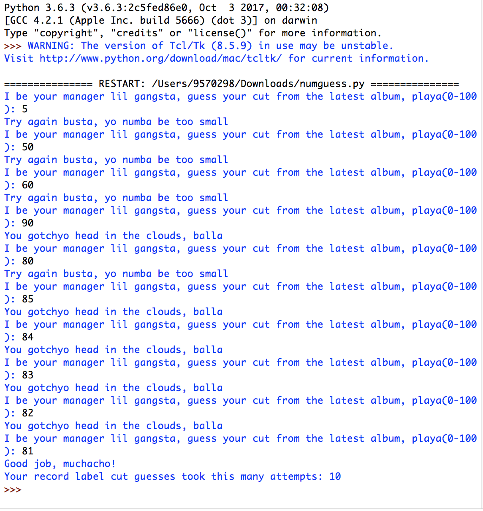
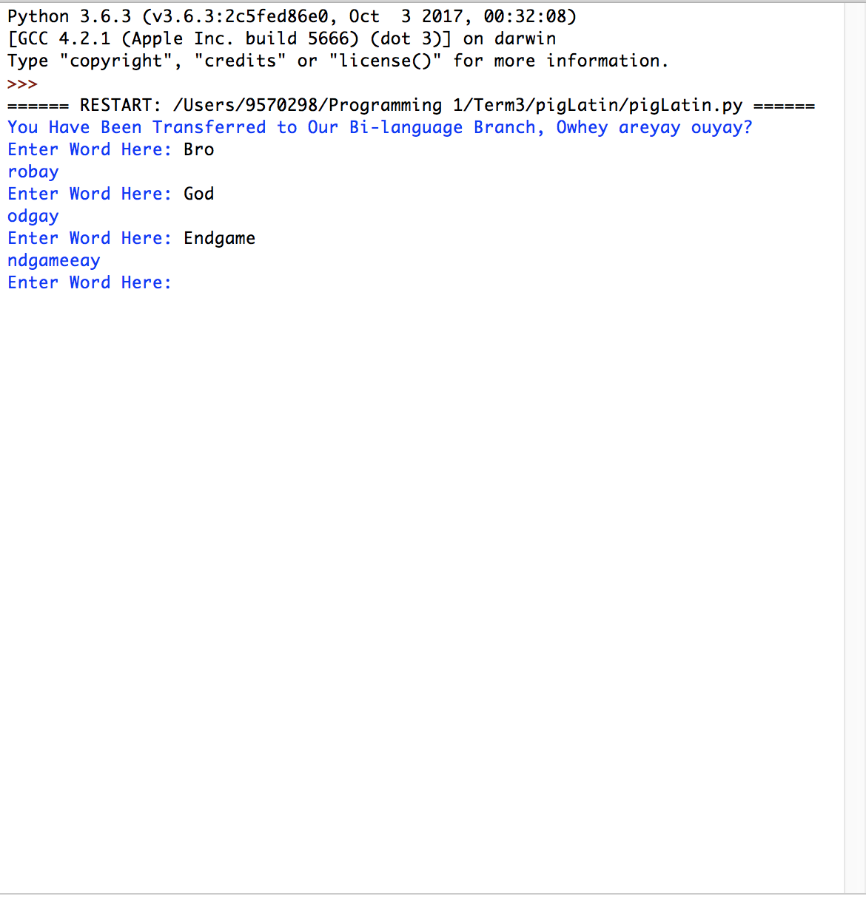

# Welcome to Daniel Wong's Programming Portfolio
### 2018-2019 Programming I | daniwong9570@granitesd.org

## Object Oriented Calculator

### Calculator:
## [Source Code](https://github.com/DandyDaniel/2019ProgPort/tree/master/Calc/Calvinator)
#### - Coded in Processing(Java).
#### - Fully Fuctional(Basic operators, Exponents, Square Roots).
#### - Thanos-themed. ;)

## Thanos-Themed Screensaver

### Screensaver:
## [Source Code](https://github.com/DandyDaniel/2019ProgPort/tree/master/ScreenSaver/ScreenSaver)
#### - Coded in Processing(Java).
#### - Fully-automatic, space luxury screensaver.
#### - Thanos Color Scheme, of course.

## Spaceship Game

### Spaceship Game:
## [Source Code](https://github.com/DandyDaniel/2019ProgPort/tree/master/SpaceshipGame/Spaceship_Game)
#### - Coded in Processing(Java).
#### - Fully Functional and Classic Spaceship Shooter Game. Complete with levels, powerups, and music.
#### - Controls with the mouse and the keyboard.
#### - Mouse to move, Mouse1/Spacebar to fire.

## Number Guesser

### Number Guesser:
## [Source Code](https://github.com/DandyDaniel/2019ProgPort/tree/master/NumberGuesser/numguess)
#### - Coded in Atom/IDLE(Python)
#### - Guess a randomly generated number from 0-100.

## Pig Latin Word Generator

### Pig Latin Word Generator:
## [Source Code](https://github.com/DandyDaniel/2019ProgPort/tree/master/PigLatin/pigLatin)
#### - Coded in Atom/IDLE(Python)
#### - Fully Fuctioning pig latin word generator.
#### - Input your word and it will take into accound the rules of Pig Latin and produce the word.

## Group Project
##[Source Code](https://github.com/SkylineHigh/A4Python/tree/master/comradeCater)

