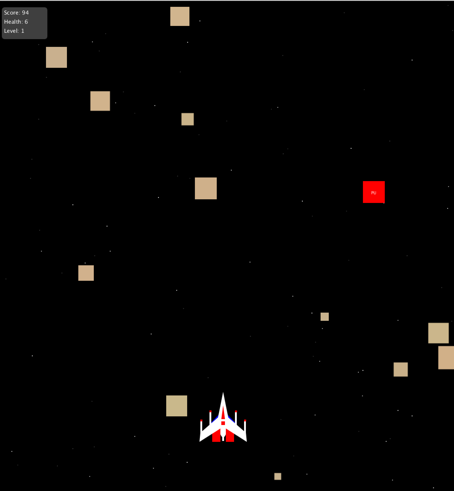

# Welcome to Daniel Wong's Programming Portfolio
### 2018-2019 Programming I | daniwong9570@granitesd.org

## Object Oriented Calculator

### Calculator:
#### - Coded in Processing(Java).
#### - Fully Fuctional(Basic operators, Exponents, Square Roots).
#### - Thanos-themed. ;)

## Thanos-Themed Screensaver

### Screensaver:
#### - Coded in Processing(Java).
#### - Fully-automatic, space luxury screensaver.
#### - Thanos Color Scheme, of course.

## Spaceship Game

### Spaceship Game:
#### - Coded in Processing(Java).
#### - Fully Functional and Classic Spaceship Shooter Game. Complete with levels, powerups, and music.
#### - Controls with the mouse and the keyboard.
#### - Mouse to move, Mouse1/Spacebar to fire.

